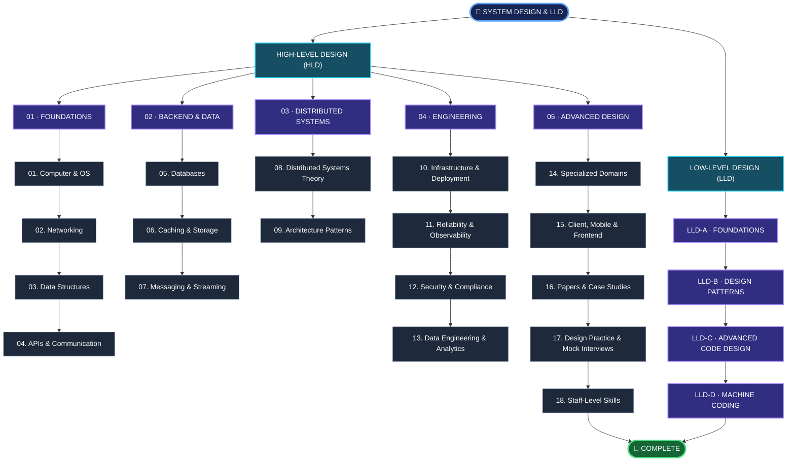

# 🗺️ System Design Learning Roadmap

```mermaid
flowchart TB
    A(["🚀 SYSTEM DESIGN & LLD"])

    A --> H["HIGH-LEVEL DESIGN (HLD)"]
    A --> L["LOW-LEVEL DESIGN (LLD)"]

    %% HLD
    H --> H1["01 · FOUNDATIONS"]
    H --> H2["02 · BACKEND & DATA"]
    H --> H3["03 · DISTRIBUTED SYSTEMS"]
    H --> H4["04 · ENGINEERING"]
    H --> H5["05 · ADVANCED DESIGN"]

    H1 --> P1["01. Computer & OS"]
    P1 --> P2["02. Networking"]
    P2 --> P3["03. Data Structures"]
    P3 --> P4["04. APIs & Communication"]

    H2 --> P5["05. Databases"]
    P5 --> P6["06. Caching & Storage"]
    P6 --> P7["07. Messaging & Streaming"]

    H3 --> P8["08. Distributed Systems Theory"]
    P8 --> P9["09. Architecture Patterns"]

    H4 --> P10["10. Infrastructure & Deployment"]
    P10 --> P11["11. Reliability & Observability"]
    P11 --> P12["12. Security & Compliance"]
    P12 --> P13["13. Data Engineering & Analytics"]

    H5 --> P14["14. Specialized Domains"]
    P14 --> P15["15. Client, Mobile & Frontend"]
    P15 --> P16["16. Papers & Case Studies"]
    P16 --> P17["17. Design Practice & Mock Interviews"]
    P17 --> P18["18. Staff-Level Skills"]

    %% LLD
    L --> L1["LLD-A · FOUNDATIONS"]
    L1 --> L2["LLD-B · DESIGN PATTERNS"]
    L2 --> L3["LLD-C · ADVANCED CODE DESIGN"]
    L3 --> L4["LLD-D · MACHINE CODING"]

    %% Completion
    P18 --> Z(["🎯 COMPLETE"])
    L4 --> Z

    %% Styling
    classDef root fill:#172554,stroke:#60A5FA,color:#fff,stroke-width:3px
    classDef main fill:#164E63,stroke:#22D3EE,color:#fff,stroke-width:2px
    classDef group fill:#312E81,stroke:#A78BFA,color:#fff,stroke-width:2px
    classDef topic fill:#1E293B,stroke:#64748B,color:#fff
    classDef finish fill:#166534,stroke:#4ADE80,color:#fff,stroke-width:3px

    class A root
    class H,L main
    class H1,H2,H3,H4,H5,L1,L2,L3,L4 group
    class P1,P2,P3,P4,P5,P6,P7,P8,P9,P10,P11,P12,P13,P14,P15,P16,P17,P18 topic
    class Z finish
```
